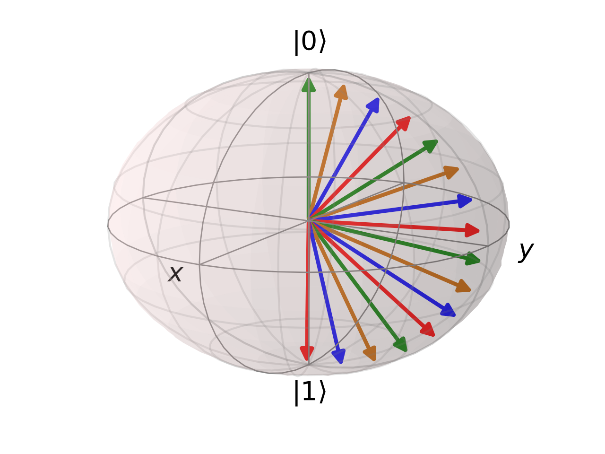

## A reinforcement learning algorithm for quantum state preparation

A central requirement in order to engineer functional quantum computers is the ability to control quantum bits (qubits) robustly, flexibly, and cost-effectively with classical control systems. A fundamental problem in quantum control is quantum state preparation: a dynamical process that involves setting up one or more qubits in a desired configuration. One potential avenue towards improved quantum state preparation is the use of reinforcement learning. Reinforcement learning is a branch of machine learning in which a computer agent learns how best to perform a task using feedback from interactions with its environment. Reinforcement learning has been applied to a variety of quantum physics problems with great success [1] [2] [3] [4] [5]. In 2018 and 2019, M. Bukov et al. and Zheng An and D. L. Zhou established the potential for quantum state preparation using reinforcement learning [6] [7]. In a comparative study on quantum state preparation, X.-M. Zhang et al. demonstrated the advantages of reinforcement learning compared to other machine learning methods in terms of scalability and efficiency [8]. Despite the favourable characteristics of the reinforcement learning approach, performance challenges remain when increasing the set of potential controls and the number of controls applied between the start and end state [8]. Recently, a reinforcement learning framework was developed to incorporate correction for control errors; however, multiple sources of error such as approximation errors and environmental defects were not considered [9]. Moving forward, there are improvements to be made by tailoring reinforcement learning algorithms specifically for quantum state preparation. There is also more work to be done investigating the ability of reinforcement learning to find control solutions that are robust enough to withstand experimental imperfections. 

The objective of my research is to design and implement a reinforcement learning algorithm which will discover a sequence of discrete controls to bring one qubit from an initial state toward a desired state. The algorithm will maximize fidelity between the final state achieved by the control and the desired state. The current iteration in the design process is a Q-learning algorithm on a quantized state space. Given an initial state and target state and a Hamiltonian with some noise, the algorithm successfully finds the optimal sequence of piecewise constant controls. For example, the evolution of the state from |0> to |1> is depicted below, where the states are represented as vectors on the Bloch sphere. 

  

 
### References

[1] 	X.-M. Zhang, Z.-W. Cui, X. Wang and M.-H. Yung, "Automatic spin-chain learning to explore the quantum speed limit," Physical Review, vol. 97, no. 052333, 2018.

[2] 	T. Fösel, P. Tighineanu, T. Weiss and F. Marquardt, "Reinforcement learning with neural networks for quantum feedback," Physical Review, vol. 8, no. 031084, 2018. 

[3] 	J. Halverson, B. Nelson and F. Ruehle, "Branes with brains: exploring string vacua with deep reinforcement learning," Journal of High Energy Physics, no. 6, 2019. 

[4] 	N. D. Hendrik Poulsen Nautrup, V. Dunjko, H. J. 
Briegel and N. Friis, "Optimizing Quantum Error Correction Codes with Reinforcement Learning," Quantum, vol. 3, p. 215, 2019. 

[5] 	A. A. Melnikov, H. P. Nautrup, M. Krenn, V. Dunjko, M. Tiersch, A. Zeilinger and H. J. Briegel, "Active learning machine learns to create new quantum experiments," Proceedings of the National Academy of Sciences of the United States of America, vol. 115, no. 6, pp. 1221-1226, 2018. 

[6] 	M. Bukov, A. G. R. Day, D. Sels, P. Weinberg, A. Polkovnikov and P. Mehta, "Reinforcement Learning in Different Phases of Quantum Control," Physical Review, no. 3, 2018. 

[7] 	Z. An and D. L. Zhou, "Deep reinforcement learning for quantum gate control," EPL, vol. 126, no. 60002, 2019. 
[8] 	X.-M. Zhang, Z. Wei, R. Asad, X.-C. Yang and X. Wang, "When does reinforcement learning stand out in quantum control? A comparative study on state preparation," NPJ Quantum Information, vol. 5, no. 85, 2019. 

[9] 	M. Y. Niu, S. Boixo, V. N. Smelyanskiy and H. Neven, "Universal quantum control through deep reinforcement learning," NPJ Quantum Information, vol. 5, no. 33, 2019. 

